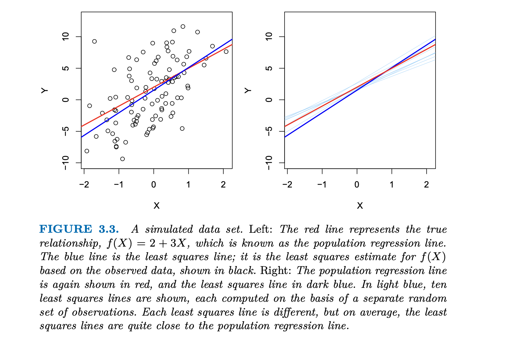

## Notes
These are notes from chapter 3 of [An Introduction to Statistical Learning](https://www.statlearning.com/).I'm reading this book along with the ML course to get a deeper understanding of each technology.

### 3.1 Simple Linear Regression
Linear regression is a very simple model that predicts the value of Y based on a single input of X. As the name implies, linear regression assumes that the relationship between X and Y is linear in nature. 

$Y\approx \beta_0+\beta_1X$

We say this as - we are regressing Y on X. For example, we can say we are regressing sales onto TV by:

$Sales\approx \beta_0+\beta_1TV$

$\beta_0, \beta_1$ are two unknown constants that represent the intercept and slope in the linear model. Together, these are known as the model coefficients or parameters. 

We use the training data to generate estimates, $\hat{\beta_0}, \hat{\beta_1}$. We can then predict future sales based on the value of TV advertising by plugging in an x to the following equation:

$\hat{y} = \hat{\beta_0} + \hat{\beta_1}x$

Here, $\hat{y}$, refers to a predicition of Y on the basis of X = $x$.

### 3.1.1 Estimating the Coefficents

Because $\hat{\beta_0}, \hat{\beta_1}$ are unknown, we need labeled data to make estimations. 

One way of measuring closeness is via Residual Sum of Squares (RSS). This is derived by summing up the deltas between the predicted value and the observed value. 

The main difference between RSS and [MSE](../Overview/notes.md) is best explained to me by Bard: *"Essentially, RSS is a raw measure of total error, while MSE normalizes it by dividing by the number of data points, giving an "average" error."*

The **least squares approach** is choosing a $\hat{\beta_0}$ and $\hat{\beta_1}$ to minimize RSS.

In the TV example, we determine (in the textbook) that $\hat{\beta_0} = 7.03$ and $\hat{\beta_1}=0.0475$. In other words, for every $1,000 spent on TV advertising, we expect to sell an additional 47.5 units. With an advertising budget of 0, we sell 7 units.

One the chart above:

1. The red line refers to the **Population Regression Line** - This represents the true underlying relationship between the independent and dependent variables in the entire population. It is often very hard to determine as we only observe a portion of this line. 
2. The blue line refers to the **least squares line** - this is the line we've drawn by minimizing the RSS value from the observed data points. 

These two lines differ by the inherent truth that we're not able to observe every point on the population regression line. 

What's interesting though - is that because the least square lines produces an estimation given some known/observed values, a different set of values would result in a different least squares line. And if you calculate enough least squares lines, the average of those values is pretty close to the actual population regression line. 

The $\hat{\mu}$, or mean, of the least squares line *should* be relatively close to the actual $\mu$ of the population regression line. But if we want to know how far they actually are, we use standard error. 