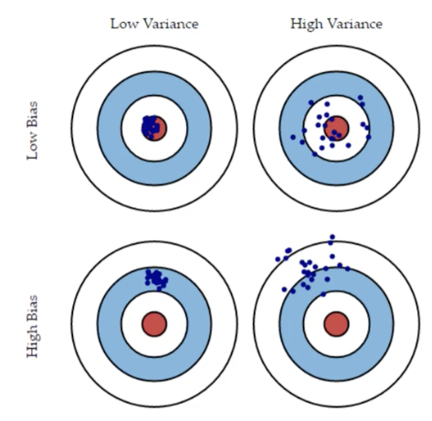
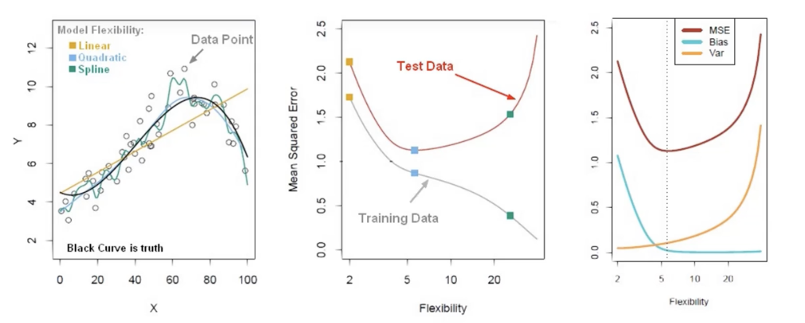

### Notes

- The bias-variance trade-off is the point where we are adding just noise by adding model complexity 
- The training error goes down (as it has to), but the test error starts going up
- The model begins to overfit

- Overfitting on your training data can cause large errors on new data (test set)

- In the example above, the Spline fit is clearly a better fit with the training data but performs poorly on the test data. What we're looking to do is minimize both training and test data loss rate.

- And in this case, the quadratic is the best option

And I think this is why you usually want three data splits - training, validation, and test. You can determine the underfit/overfit on the validation set and do a final eval on the test set. 
