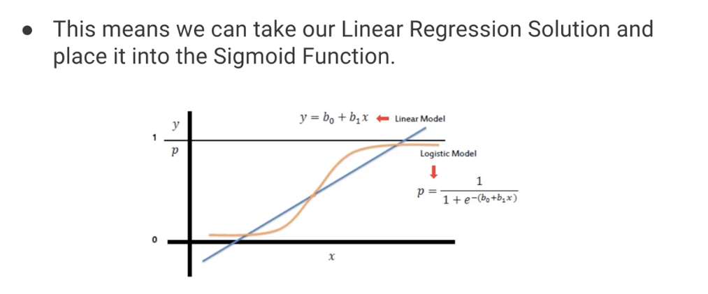
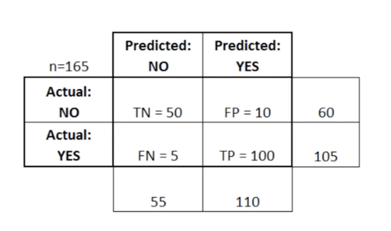

### Notes

- Logistic Regression is a method for **classification**

- We can take a linear model and put it into a sigmoid function to turn it into a logistc model
- This results in a probability from 0 to 1. We can then set a cutoff point (0.5) --> anything below is class 0. Anything above is class 1.

#### Evaluation
- A confusion matrix is typically used to evaluate a classification model (see below)

FP = type 1 error
FN = type 2 error

There's a few different metrics we can use here:

1. **Accuracy** ("Overall, how often is the model correct?")

    $\dfrac{(TP+TN)}{total} = \dfrac{150}{165} = 0.91$

2. **Error Rate**/Misclassification Rate ("Overall, how often is it wrong?)

    $\dfrac{(FP+FN)}{total} = \dfrac{15}{165} = 0.09$

#### Jupyter Notebook Notes
- When using dummy variables, always drop the first - otherwise, we run into multicollinearity where one column is a perfect predictor of another column - this tends to mess with algorithm training