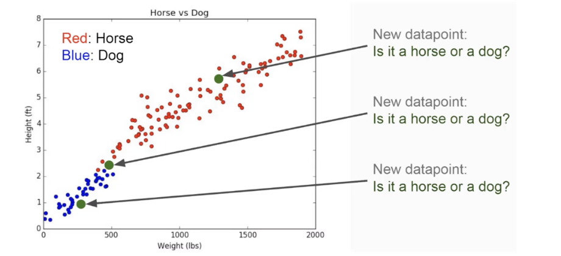
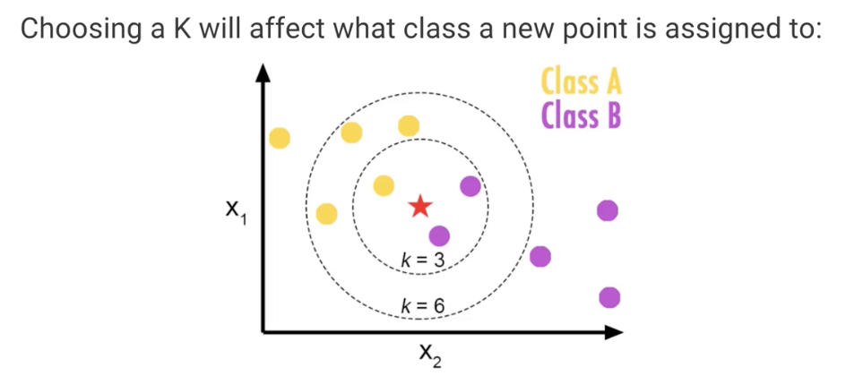

### Notes

- KNN is a classification algorithm

Example:
- imagine we had some imaginary data on dogs and horses, with heights and weights

- There's a clear clustering of dogs/horses. Here's how it works:

  For **training** - we simply store all the data

  For **prediction**:
    1. we calculate the distance from x to all the points in your data
    2. Sort the points by increasing distances from x
    3. Predict the majority label of the "k" closest points

Choosing a K will affect what class a new point is assigned to:

**Pros:**

1. Very simple
2. Training is trivial
3. Works with any number of classes
4. Easy to add more data
5. Few parameters:
    - K
    - Distance Metric

**Cons:**

1. High prediction cost (worse for large data sets)
2. Not good with high dimensional data
3. Categorical features don't work too well

#### Jupyter Notebook Notes
When using KNN, scale matters - larger the number in a column, the bigger impact it will have on determining distances. Because of that, we need to standardize to the same scale. 