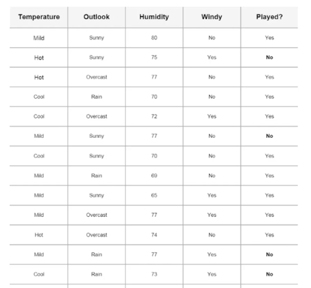
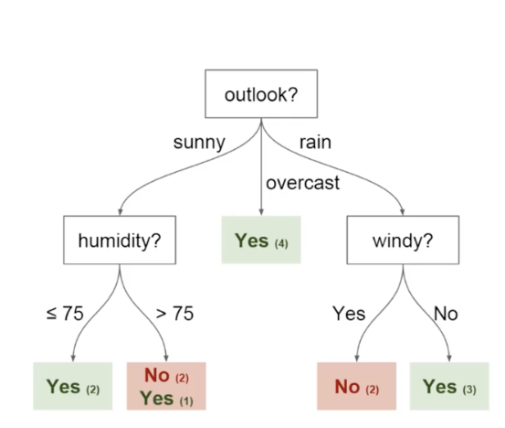
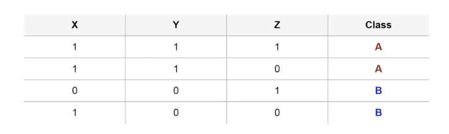
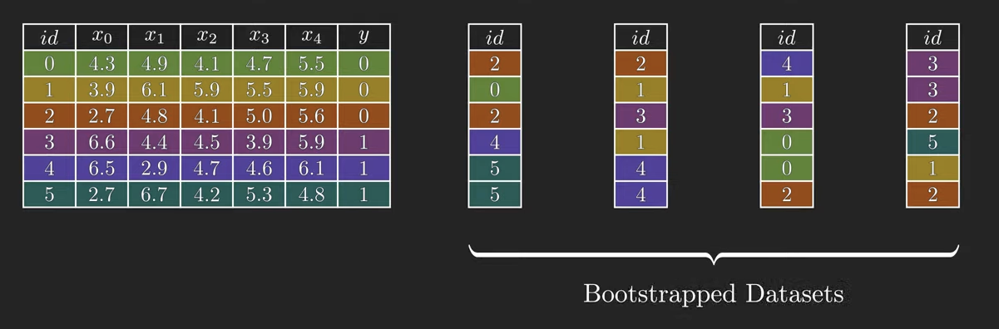
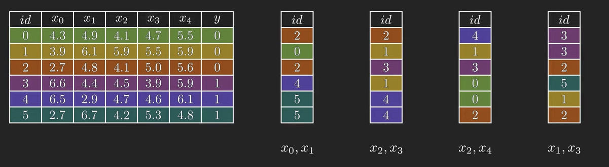
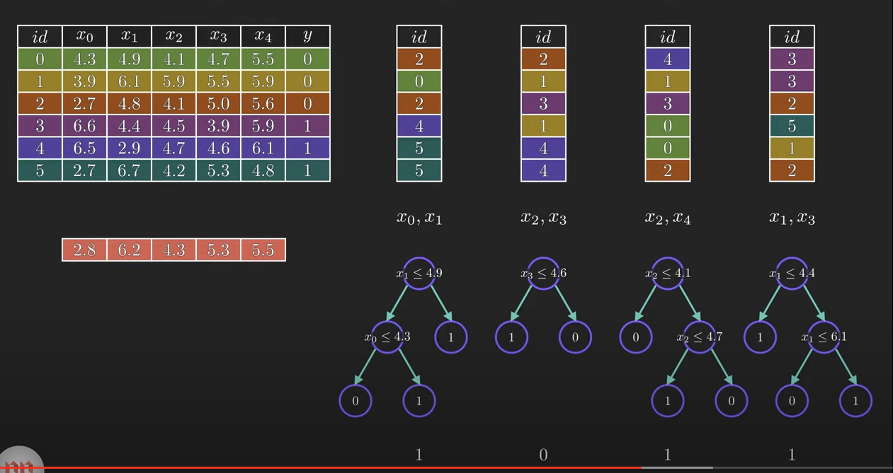

### Decision Trees and Random Forest Notes

Thought experiment for why we should use a decision tree matrix:
- Imagine that I play Tenis every Saturday and I always invite a friend to come with me
- Sometimes my friend shows up, sometimes not
- For him, it depends on a variety of factors, such as: weather, temperature, humidity, wind, etc
- I start keeping track of these features and whether or not he showed up to play with me

Example of data below:

We can use a decison tree to predict whether or not the friend will show up to play:

In the tree, we have:
1. **Nodes** - Split for the value of a certain attribute (Outlook/Humidity/Windy/etc)
    1. **Root Node -** The node that performs the first split
2. **Edges** - Outcome of a split to next node (Sunny/Rain/Overcast)
3. **Leaves** - Terminal nodes that predict the outcome (Yes/No)

Choosing the best split for the root node is important:

For example:
1. Splitting on Y is seperation of classes A & B
2. Splitting on X and Z doesn't seperate classes

To determine the correct split, we use entropy and information gain. 

Decison Trees don't have the best prediction accuracy because it's so highly dependent on the specific split. We can overcome that by using Random Forest

- Random forest works by creating hundreds of decison trees by Bootstrapping the original dataset. [(source)](https://www.youtube.com/watch?v=v6VJ2RO66Ag)

- Then, we'll only use a portion of the features for each training. 

- Now, we can use all these individual trees to create predictions for a new observation. Then, we can combine the outcomes of each tree into one overall classification. In the below example, 1 is the overall winner. 

Why do we use bootstrapping and random feature selection?
- This ensures that we're not using the same data in every tree. It helps us identify features that are strongly correlated with specific outputs. This also helps decrease the variance. 