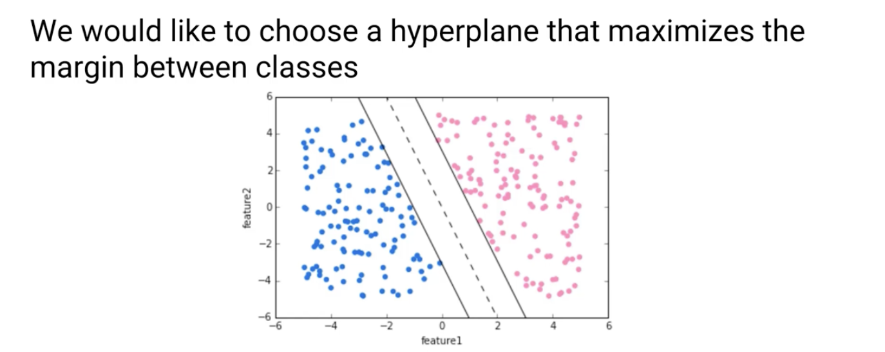
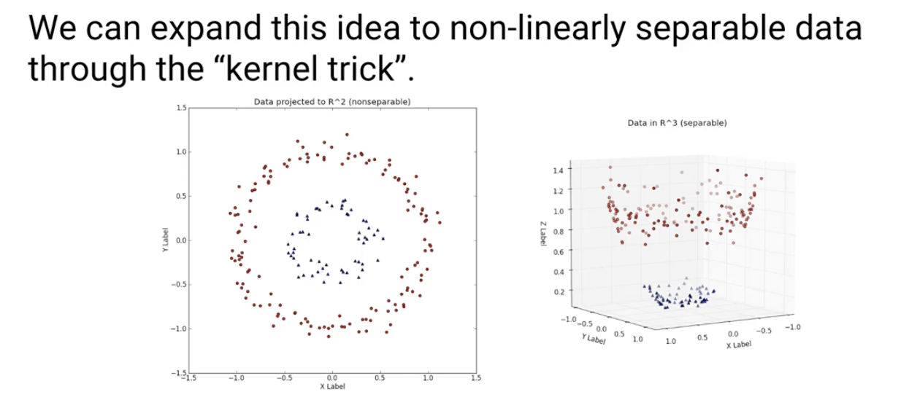

### Notes

- supervised learning models with learning algorithms that analyze data and recognize patterns - used for classification and regression analysis
- SVM model is a representation of the examples as points in space, mapped so that the examples of the separate categories are divided by a clear gap that is as wide as possible
- Our goal is to select a hyperplane that maximizes the margin between the two classes

- the vector points that the margin lines touch are called "Support Vectors"
- In cases where there is no clear line in the 2D, we can expand to higher dimensions by incorporating additional labels like 