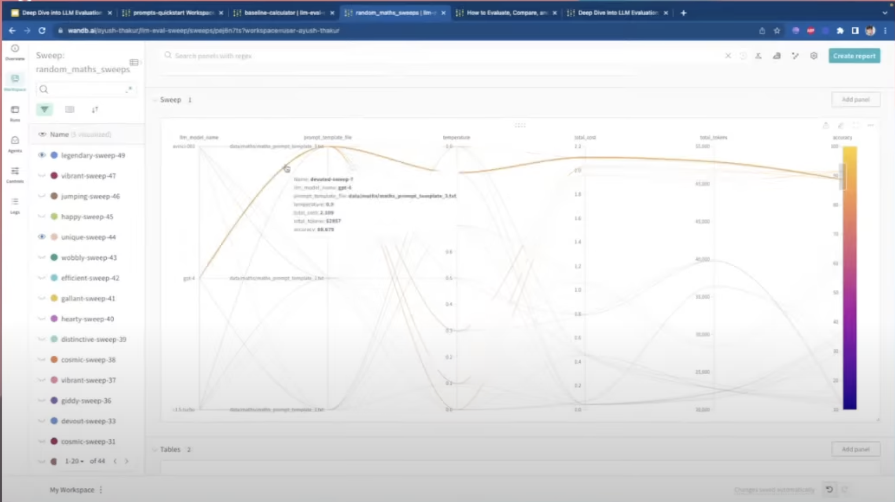

### Eval Notes

[source](https://www.youtube.com/watch?v=7EcznH0-of8)

In traditional ML, we split the dataset into:
1. Training Set - What you use to train the model
2. Validation Set - What you use to tune the model
3. Test Set - What you use to test the final model

That, unfortunately, is not the case for LLMs:

There are a few different ways of evaluating LLMs today but there's a few tradeoffs:

Weights & Biases allow for users to experiment different models and prompts with a given benchmark.

