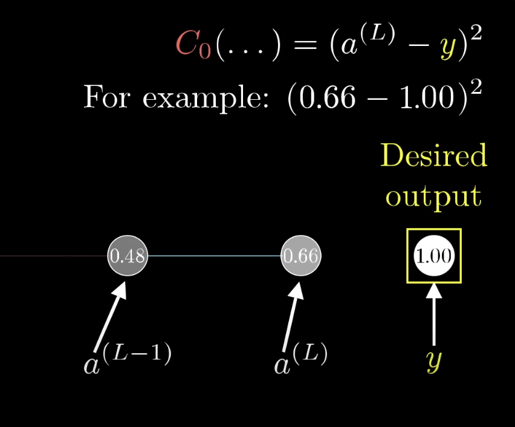
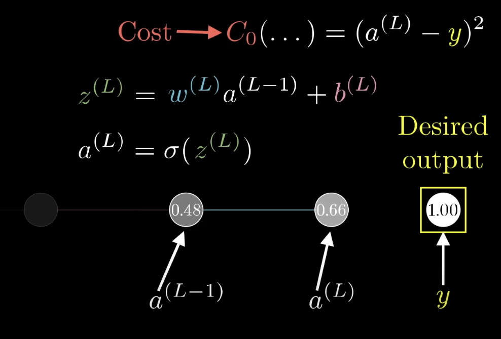
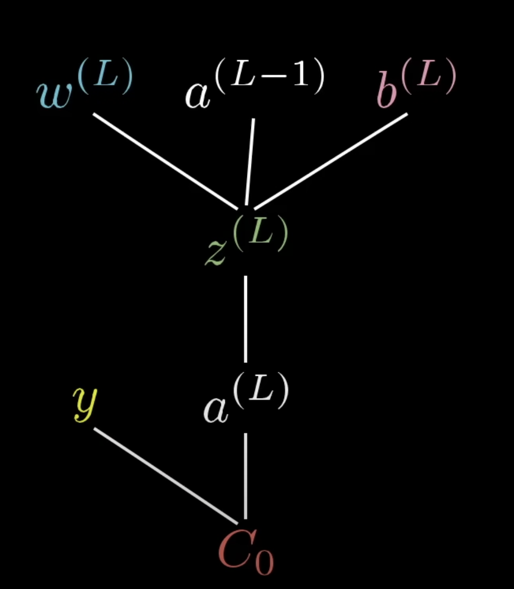
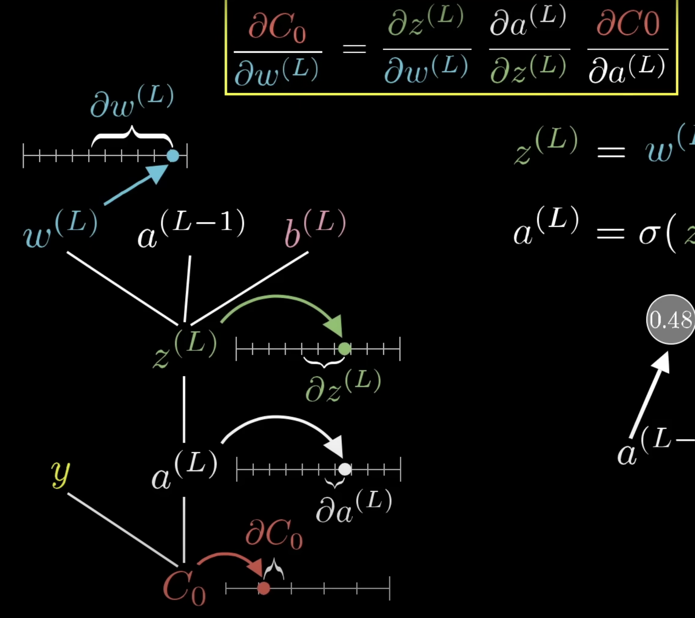

### Calculus of Neural Networks

Suppose we have a super simple neural network of four neurons. This network contains 3 weights, and 3 biases. Therefore the cost function is:
$C(w_1,b_1,w_2,b_2,w_3,b_3)$.

We would like to know which weights and biases are are most sensitive to the cost function - that way we know what to tune. 

We can say the cost function for the last neuron in this example
 is:

$C_0 = (a^L - y)^2$

And $a^L$ is calculated by multiplying the previous neuron's activation * the weight + some bias:

$a^L = w^L * a^{L-1} + b^L$

We can then wrap this in a sigmoid or RELU function. 

For simplicity, let's substitute $z$ for the function above so that:

$z^L = w^L * a^{L-1} + b^L$

$a^L = \sigma(z^L)$

In other words, here is the calculation tree:

With all these elements combining with Y to calculate the cost. 

$a^L-1$ is basically this same image on top of the existing image, etc, etc. 

Ultimately, we'd like to calculate how sensitive each weight is to the final cost.

We can do this by taking the ratio of the deltas between $\nabla C_0$ and $\nabla w^L$.

So now when we can compute: 

$\dfrac{\nabla C_0}{\nabla w^L} = 2(a^L-y)$

Notice that $2(a^L-y)$ is the derivative of the original cost function, $C_0 = (a^L - y)^2$.