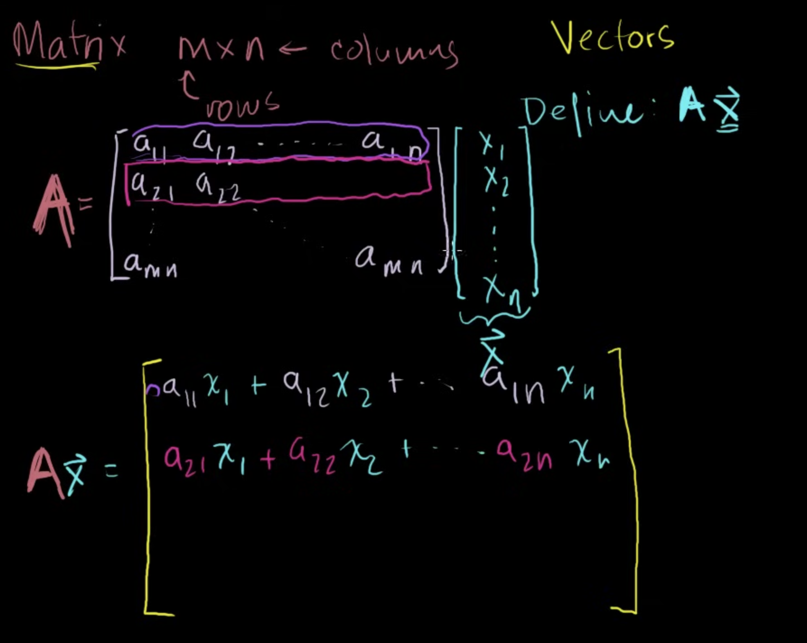
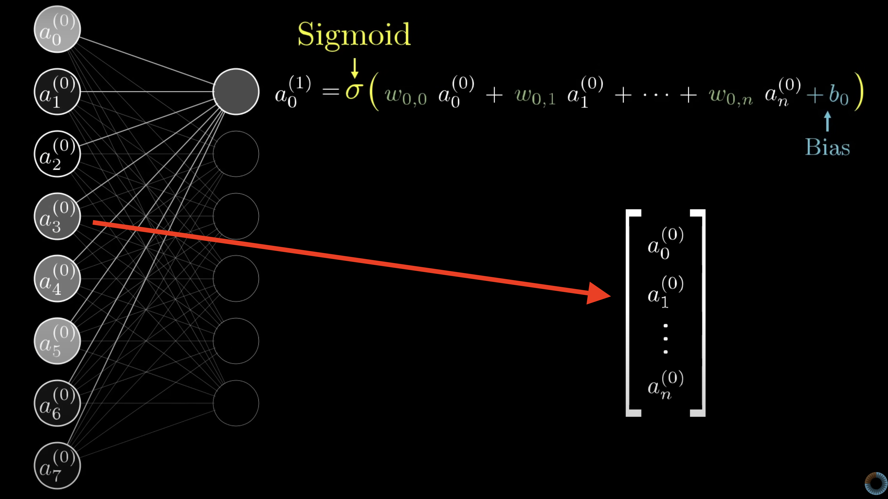

### Notes

Above is a high level example of a perceptron model. In this model, we can feed in multiple inputs (x1, x2, xn, etc) with associated weights and biases. These are then outputted as a single value.

The weights can be changed based on learnings to output a specific y. And if an input is zero, the bias helps ensure the input is non zero. 

To build a neural network, we can chain a bunch of these perceptrons into a chain:

Outputs of one perceptron are feed in as inputs into another perceptron (neuron).

- The first layer is called the input layer
- The last layer is called the output layer
- Layers in between are called hidden layers
    - these layers are difficult to interpret due to their high interconnectivity and distance away from known inputs or outputs 
    - a Neural network becomes a deep neural network when there are 2 or more hidden layers

In the example above, the input layer has 784 neurons for each of the pixels in a 28x28 pixel image of the number 3.

The output layer has 10 neurons - one for the range of 0-9.

In some cases (classification tasks), we'd like there to be some upper limit of the value of each neuron (ex: 0 or 1 cases). We can use activiation functions in these cases to set boundaries on these neurons. 

#### Activation Functions

In the neuron example, we saw: $x*w+b$ where:
1. $w$ is a weight - or how much weight we give to an incoming input. 
2. $b$ is a bias - or an offset value making $x*w$ reach a certain threshold before having an effect

In the handwritten # example, the weights tell us what pixel pattern the neuron is picking up on. And the bias tells us how high the weighted sum needs to be, before the neuron picks on it. 

For example, to determine whether or not there is an edge - we can use positive weights in a certain region and compare with negative weights in bordering region.

When we say that a neural net is learning - we're basically getting the computer to try a bunch of different weights and biases to solve the problem at hand. 

#### Matrix Shorthand
So the equation, $w_1a_1 + w_2a_2 + ... + w_na_n $ is pretty cumbersome. We can write this in shorthand notation using Matrixes - but first quick review of matrix/vector multiplication.

The key when multiplying a matrix and a vector is that the length of the vector must be the same size as the width of the matrix.

Then, we iterate through each $i$ of a matrix row and multiply it against each $j$ of the vector row.

With that - we then organize all the activations from one layer into a vector.

Then, we organize all the weights as a matrix - where each row corresponds with the weights of layer and a particular neuron in the second layer.

We can then add the biases as another vector. Finally, we can wrap the sigmoid around everything - this effectively means that we're going to apply the sigmoid function to each resulting vector element. 

#### Neural Network Training
We use cost functions to penalize incorrect answers. This is calculated by taking the square of the diff from model output and the correct output. Basically MSE.

We then run this across all the training data examples and come up with the average cost. Ideally, we'd liketo find a (set of) inputs to minimize this cost function result - we can do this by finding the local minimum. 

ie - go left, go right. Then go the direction where the minimum is until you get to the local minimum.

Note that the local minimum may be different than the global minimum - it depends on where you start. But finding the global minimum is incredibly challenging. 

It's also helpful to make your step sizes proportional to the slope, the step sizes get smaller and smaller the closer you get to the local minimum. This helps avoid overshooting. 

Getting more detailed, minimizing the cost function is effecitvely trying a bunch of weights and biases on a set of known data.

#### Backpropagation

To get to the final output we're looking for, we have three levers:

1. Increase bias
2. Increase weights in proportion to the last layer
3. Change the weights in proportion to the weights (we can't actually do that - but good to keep track of)

By adding together all these desired effects, we effectively have all the nudges we want to apply to the previous layer. 

You can then recursively apply the same process to each layer before that. 

But... this has all been for one training example. If we optimize for just one example, we're incentivizing the model to return "2" for every new inference - even if it's "5" - which is not ideal.

So we run this process for every single training example and average all the desired changes to get the most optimal weights. 

In practice, this takes forever and we don't need to go through every.single.iteration.

#### Stochastic Gradient Descent

What we do, instead, is we randomly shuffle our training data and divide it up into mini batches. We run the gradient descent on these mini batches. 