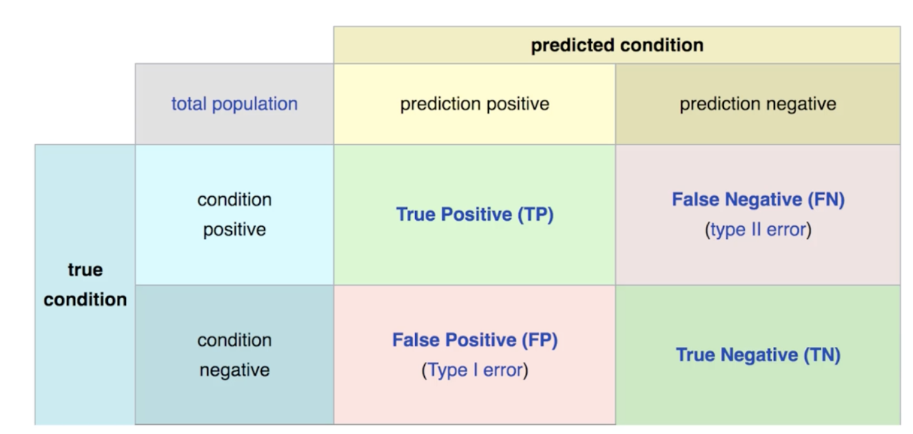

## Notes

###  Supervised Learning Overview
- Supervised learning are trained on labeled data (spam vs not spam, etc)

- Mainly useful when historical data is likely to predict future events

Three Datasets:

1. Training Data - used to train model parameters

2. Validation Data - used to determine what model hyperparameters to adjust

3. Test Data - used to get some final performance metric

Once you're on the final test dataset, you're technically not allowed to go back and adjust the model.

### Model Evaluation for Classification

1. **Accuracy** - the # of correct predictions/the total # of predicitions
   - Accuracy is useful when target classes are well balanced
   - Not useful when the target classes are unbalanced (99 images of cats, 1 of dog) - if our model always said cat, we'd get 99% accuracy
2. **Recall** - the ability of a model to find all the relevant cases within a dataset
   - **definition**: # of true positives/(# of true positives + # of false negatives)
3. **Precision** - the ability of a classification model to identify only the relevant data points
   - **definition**: # of true positives/(# of true positives + # of false positives)
4. **F1 Score** - cases where we want to find the optimal blend of precision and recall
   - **definition**: $F_1=2*\dfrac{precision*recall}{precision+recall}$
   - we use harmonic mean to punish the outliers

There's often a tradeoff between Recall and Precision:
 - while recall expresses the ability to find all relevant instances in a dataset,
 - precision expresses the proportion of the data points our model says was relevant, actually were relevant

#### Confusion Matrix

### Model Evaluation for Regression

Regression is a task when model attempts to predict continous values. To evaluate regression tasks, we use the following metrics:

1. **Mean Absolute Error** - mean of the absolute value of deltas between predicted value and actual value
   - Problem with this approach, however, is that this doesn't penalize enough for outliers
2. **Mean Squared Error** - mean of the absolute value of the SQUARE of the deltas between predicted value and actual value
   - **Upside:** This approach DOES penalize outliers so it's usually more popular than Mean Absolute Error
   - **Downside:** Not super interpretable since it ^2 all the units
3. **Root Mean Square Error** - Same as MSE but now we just take the square root to bring measurement back standard units
   - **Upside:** Most popular approach because it both: 1) penalizes outliers and 2) is an in interpretable format